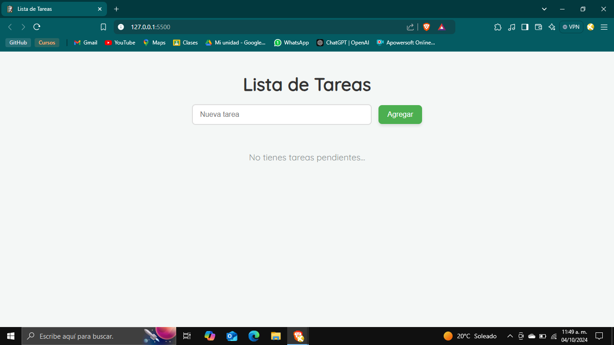
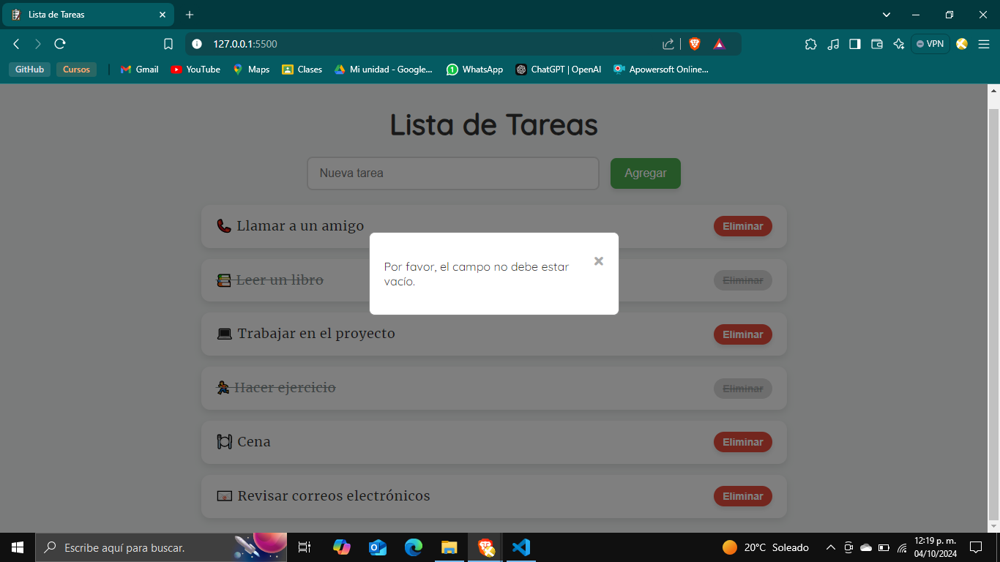

# Lista-de-Tareas-Interactiva
Aplicación web simple que permite a los usuarios agregar, visualizar y eliminar tareas de una lista utilizando HTML, CSS y JavaScript con el fin de comprender los fundamentos de la manipulación del DOM, manejo de eventos y almacenamiento de datos en el navegador.

**Enlace desplegado en GitHub Pages:** [https://enethel110.github.io/Lista-de-Tareas-Interactiva/](https://enethel110.github.io/Lista-de-Tareas-Interactiva/)

## Instrucciones para ejecutar la aplicación

### Opción 1: Ejecutar en línea
Por favor, ejecuta el programa directamente desde el enlace mencionado anteriormente y comienza a utilizar la aplicación.

### Opción 2: Ejecutar de manera local
1. Descarga o clona este repositorio.
2. Haz clic en el archivo `index.html`, que se abrirá en tu navegador predeterminado.
3. ¡Listo! Ya podrás utilizar la aplicación.

## Imágenes
### Interfaz Principal

### Añadir Tarea

### Modal campos vacios

### Modal tarea repetida

